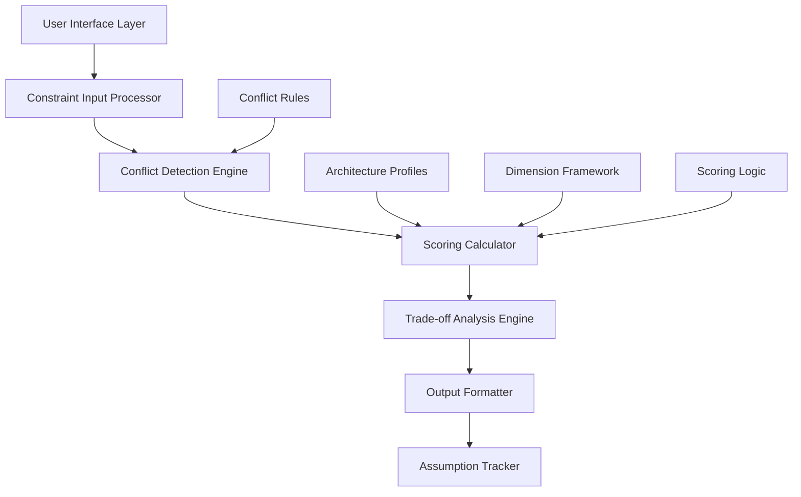

# Design Document: SecureStack Referee

## Overview

SecureStack Referee is an enterprise decision-support system that provides structured comparative analysis of three security architecture patterns without making prescriptive recommendations. The system functions as a digital architectural review board, helping enterprise stakeholders understand trade-offs between IRM-heavy (Identity & Risk Management centric), URM-heavy (User Risk & Behavioral centric), and Hybrid security architectures.

The system emphasizes transparency, explainability, and human oversight while avoiding the pitfalls of oversimplified recommendations. It serves as an analytical framework that accelerates decision-making processes by surfacing relevant trade-offs and conflicts rather than hiding complexity behind algorithmic black boxes.

## Architecture

### System Components



### Core Principles

1. **Decision Support, Not Decision Making**: All outputs emphasize that human judgment is required
2. **Transparency Over Simplicity**: Complex trade-offs are surfaced rather than hidden
3. **Comparative Analysis**: Relative strengths and weaknesses rather than absolute scores
4. **Assumption Tracking**: All assumptions are explicit and traceable
5. **Conflict Surfacing**: Organizational tensions are identified and explained

## Components and Interfaces

### 1. Product Definition Module

**Purpose**: Establishes clear boundaries and expectations for system capabilities

**Core Functions**:
- Defines what the system does: comparative analysis, trade-off identification, conflict detection
- Explicitly states what it does NOT do: recommendations, implementation guidance, vendor selection
- Maintains consistent messaging about decision support vs decision making

**Interface**: Static content delivery with clear capability statements

### 2. User Persona Framework

**Primary Persona: Chief Information Security Officer (CISO)**
- **Responsibilities**: Strategic security decisions, budget authority ($5M-100M+), board reporting
- **Pain Points**: Justifying architecture decisions with data, communicating trade-offs to non-technical stakeholders
- **Success Criteria**: Defensible recommendations backed by analysis, improved stakeholder confidence

**Secondary Persona: Enterprise Security Architect**
- **Responsibilities**: Technical architecture design, cross-functional stakeholder management, implementation oversight
- **Pain Points**: Balancing competing requirements, managing technical complexity, ensuring scalability
- **Success Criteria**: Comprehensive trade-off analysis, reduced decision time, improved architecture quality

### 3. Decision Dimension Framework

The system evaluates architectures across seven core dimensions:

#### Dimension 1: Identity Verification Strength
- **Why it matters**: Determines confidence in user authentication and authorization decisions
- **Trade-offs**: Stronger verification increases security but reduces user experience and increases complexity
- **Over-optimization risks**: Excessive verification can drive shadow IT adoption and reduce productivity

#### Dimension 2: Behavioral Analytics Sophistication  
- **Why it matters**: Enables detection of anomalous behavior and insider threats through pattern analysis
- **Trade-offs**: Advanced analytics improve threat detection but require significant infrastructure and privacy considerations
- **Over-optimization risks**: Complex analytics can generate false positives and require specialized expertise

#### Dimension 3: Operational Complexity
- **Why it matters**: Affects team capability requirements, maintenance overhead, and system reliability
- **Trade-offs**: Simple systems are easier to manage but may lack advanced security capabilities
- **Over-optimization risks**: Over-simplification can leave security gaps; over-complexity can cause operational failures

#### Dimension 4: User Experience Friction
- **Why it matters**: Influences user adoption, productivity, and shadow IT risk
- **Trade-offs**: Low friction improves business enablement but may reduce security control effectiveness
- **Over-optimization risks**: Excessive focus on UX can compromise security; excessive friction drives workarounds

#### Dimension 5: Compliance Auditability
- **Why it matters**: Supports regulatory requirements and reduces audit costs and risks
- **Trade-offs**: High auditability requires extensive logging and controls but increases operational overhead
- **Over-optimization risks**: Excessive compliance focus can impede business agility and innovation

#### Dimension 6: Scalability & Performance
- **Why it matters**: Determines system ability to handle growth and peak loads without degradation
- **Trade-offs**: High scalability requires architectural investment but supports business growth
- **Over-optimization risks**: Over-engineering for scale can increase costs; under-engineering limits growth

#### Dimension 7: Cost Efficiency
- **Why it matters**: Affects budget allocation and ROI on security investments
- **Trade-offs**: Lower costs may require capability compromises or increased operational risk
- **Over-optimization risks**: Excessive cost focus can compromise security; ignoring costs limits adoption

### 4. Architecture Option Profiles

**Comparative Scoring Matrix (1-10 scale)**:

| Dimension | IRM-Heavy | URM-Heavy | Hybrid | Rationale |
|-----------|-----------|-----------|---------|-----------|
| Identity Verification Strength | 9 | 4 | 7 | IRM emphasizes strong authentication; URM relies on behavioral patterns |
| Behavioral Analytics Sophistication | 3 | 9 | 6 | URM specializes in behavior analysis; IRM uses traditional controls |
| Operational Complexity | 7 | 8 | 8 | All approaches require skilled teams; URM/Hybrid add ML complexity |
| User Experience Friction | 6 | 3 | 5 | URM minimizes friction; IRM requires more user interaction |
| Compliance Auditability | 9 | 5 | 7 | IRM provides clear audit trails; URM relies on algorithmic decisions |
| Scalability & Performance | 6 | 7 | 6 | URM handles dynamic scaling better; IRM has predictable patterns |
| Cost Efficiency | 5 | 4 | 5 | Similar infrastructure costs with different operational profiles |

**Architecture Strengths, Weaknesses, and Risks**:

**IRM-Heavy Architecture**:
- *Strengths*: Strong compliance support, clear audit trails, established security patterns, predictable behavior
- *Weaknesses*: Limited behavioral threat detection, higher user friction, less adaptive to new threats
- *Risks*: May miss sophisticated insider threats, user experience friction could drive shadow IT

**URM-Heavy Architecture**:
- *Strengths*: Superior user experience, advanced threat detection, adaptive security controls, scalable analytics
- *Weaknesses*: Complex operational requirements, algorithmic decision opacity, privacy considerations
- *Risks*: False positive management, specialized skill requirements, regulatory interpretation challenges

**Hybrid Architecture**:
- *Strengths*: Balanced approach, flexibility to emphasize different aspects, comprehensive coverage
- *Weaknesses*: Increased complexity, potential integration challenges, requires expertise in both approaches
- *Risks*: Jack-of-all-trades syndrome, higher operational overhead, decision complexity

### 5. Constraint Input Model

**Weighted Organizational Inputs (1-10 scale)**:

1. **Risk Tolerance** (inverse scale: 1 = high tolerance, 10 = very low tolerance)
2. **Compliance Strictness** (1 = minimal requirements, 10 = highly regulated environment)
3. **Cost Sensitivity** (1 = cost not a factor, 10 = extremely cost-constrained)
4. **User Experience Priority** (1 = security over UX, 10 = UX critical for adoption)
5. **Operational Maturity** (1 = basic capabilities, 10 = advanced security operations)
6. **Business Agility** (1 = stable environment, 10 = rapid change requirements)

**Missing Input Handling**:
- Default all missing weights to 5 (medium priority)
- Generate explicit assumption statements for each default
- Flag incomplete assessments and recommend stakeholder input
- Allow iterative refinement of constraints

### 6. Conflict Detection Engine

**Common Constraint Conflicts**:

**Conflict 1: High Compliance vs Low Cost**
- *Why it exists*: Comprehensive compliance controls require significant infrastructure investment
- *Detection logic*: `compliance_strictness >= 8 AND cost_sensitivity >= 8`
- *System communication*: "Potential tension detected: High compliance requirements typically require significant security infrastructure investment, which may conflict with cost optimization objectives."

**Conflict 2: Low Risk Tolerance vs High User Experience Priority**
- *Why it exists*: Strong security controls inherently introduce user interaction and verification steps
- *Detection logic*: `risk_tolerance <= 3 AND user_experience_priority >= 8`
- *System communication*: "Trade-off tension identified: Seamless user experience goals may be incompatible with strong security requirements for high-risk environments."

**Conflict 3: High Business Agility vs Low Operational Maturity**
- *Why it exists*: Rapid business changes require sophisticated, flexible security architectures
- *Detection logic*: `business_agility >= 8 AND operational_maturity <= 4`
- *System communication*: "Capability gap noted: High business agility requirements may exceed current operational team capacity for managing adaptive security architectures."

**Conflict 4: High Compliance vs High Business Agility**
- *Why it exists*: Regulatory requirements often impose process constraints that slow business adaptation
- *Detection logic*: `compliance_strictness >= 8 AND business_agility >= 8`
- *System communication*: "Regulatory tension identified: Strict compliance requirements may limit the speed of business process adaptation and innovation."

## Data Models

### Constraint Profile
```typescript
interface ConstraintProfile {
  riskTolerance: number;           // 1-10 scale (inverse)
  complianceStrictness: number;    // 1-10 scale
  costSensitivity: number;         // 1-10 scale
  userExperiencePriority: number;  // 1-10 scale
  operationalMaturity: number;     // 1-10 scale
  businessAgility: number;         // 1-10 scale
  inputCompleteness: boolean;      // tracks missing inputs
  assumptions: string[];           // explicit assumption list
}
```

### Architecture Score
```typescript
interface ArchitectureScore {
  architectureType: 'IRM-Heavy' | 'URM-Heavy' | 'Hybrid';
  dimensionScores: {
    identityVerification: number;
    behavioralAnalytics: number;
    operationalComplexity: number;
    userExperience: number;
    complianceAuditability: number;
    scalabilityPerformance: number;
    costEfficiency: number;
  };
  weightedScore: number;
  confidenceLevel: 'High' | 'Medium' | 'Low';
}
```

### Analysis Result
```typescript
interface AnalysisResult {
  constraintProfile: ConstraintProfile;
  architectureScores: ArchitectureScore[];
  detectedConflicts: ConflictWarning[];
  tradeoffSummary: TradeoffAnalysis;
  assumptions: AssumptionDisclosure[];
  interpretationGuidance: string[];
}
```

## Correctness Properties

*A property is a characteristic or behavior that should hold true across all valid executions of a system—essentially, a formal statement about what the system should do. Properties serve as the bridge between human-readable specifications and machine-verifiable correctness guarantees.*

Before defining the correctness properties, I need to analyze the acceptance criteria from the requirements to determine which are testable as properties, examples, or edge cases.

Based on the prework analysis, I can identify several properties that can be consolidated to eliminate redundancy. The following correctness properties represent the unique validation requirements:

### Property 1: Complete Architecture Coverage
*For any* valid constraint input, the system analysis shall include comparative evaluation of all three architecture types (IRM-heavy, URM-heavy, and Hybrid) with scores for all defined dimensions.
**Validates: Requirements 1.1, 3.1, 4.1**

### Property 2: Assumption Transparency
*For any* analysis with missing or incomplete inputs, all assumptions made by the system shall be explicitly documented and easily identifiable in the output.
**Validates: Requirements 1.3, 5.3, 8.4, 10.3**

### Property 3: No Universal Recommendations
*For any* system output, the analysis shall never declare a single architecture option as universally superior or use recommendation language such as "best," "optimal," or "should choose."
**Validates: Requirements 1.4, 4.4**

### Property 4: Content Boundary Compliance
*For any* system output, the content shall not include vendor recommendations, product guidance, compliance guarantees, or legal interpretations.
**Validates: Requirements 1.5, 1.6, 9.2, 9.3**

### Property 5: Decision Support Messaging
*For any* system output, the analysis shall explicitly state that it provides decision support rather than decisions and require human oversight.
**Validates: Requirements 1.7, 9.1**

### Property 6: Conflict Detection and Explanation
*For any* constraint profile with known conflicts (such as high compliance + low cost), the system shall detect the conflict and provide neutral explanation of why it exists and its implications.
**Validates: Requirements 1.2, 6.1, 6.2, 6.3**

### Property 7: Persona-Appropriate Content
*For any* selected user persona, the system output shall include content relevant to that persona's responsibilities and decision-making context.
**Validates: Requirements 2.1, 2.2**

### Property 8: Enterprise-Appropriate Communication
*For any* system output, the language and format shall be suitable for enterprise audiences including board-level reporting and multi-stakeholder review.
**Validates: Requirements 2.3, 2.4, 10.5**

### Property 9: Comprehensive Dimension Analysis
*For any* evaluation dimension, the system shall explain why it matters, what trade-offs it introduces, and risks of over-optimization.
**Validates: Requirements 3.2, 3.3, 3.4**

### Property 10: Balanced Architecture Analysis
*For any* architecture option, the system shall provide balanced analysis including strengths, weaknesses, and risks without declaring superiority.
**Validates: Requirements 4.2, 4.3, 4.5**

### Property 11: Input Validation and Consistency
*For any* constraint input, the system shall validate format (1-10 scale), completeness, and flag contradictory combinations.
**Validates: Requirements 5.1, 5.2, 5.4**

### Property 12: Interactive Constraint Impact
*For any* constraint modification, the system shall update the analysis and show how changes affect results in a traceable manner.
**Validates: Requirements 5.5, 10.4**

### Property 13: Transparent Scoring Methodology
*For any* scoring calculation, the methodology shall be documented, reproducible, and show how organizational constraints influence results.
**Validates: Requirements 7.1, 10.1, 10.2**

### Property 14: Near-Tie Detection
*For any* analysis where architecture scores are within defined thresholds, the system shall identify near-ties and state "no clear winner."
**Validates: Requirements 7.2, 7.3**

### Property 15: Trade-off Emphasis Over Scores
*For any* system output, trade-off analysis content shall be more prominent than numeric scores, with clear interpretation limitations.
**Validates: Requirements 7.4, 7.5**

### Property 16: Complete Output Structure
*For any* analysis result, the output shall include comparison table, trade-off summary, conflict warnings (if applicable), assumption disclosures, and interpretation guidance.
**Validates: Requirements 8.1, 8.2, 8.3, 8.5**

### Property 17: Uncertainty and Limitation Communication
*For any* system output, uncertainty, analysis limitations, and need for professional validation shall be clearly communicated without false precision.
**Validates: Requirements 9.4, 9.5, 9.6**

## Error Handling

### Input Validation Errors
- **Invalid constraint weights**: System shall reject inputs outside 1-10 range with clear error messages
- **Missing required inputs**: System shall apply defaults and generate explicit assumption disclosures
- **Contradictory constraints**: System shall flag conflicts and suggest stakeholder alignment

### Processing Errors
- **Scoring calculation failures**: System shall provide fallback analysis with reduced precision
- **Conflict detection failures**: System shall proceed with analysis but note detection limitations
- **Output formatting errors**: System shall provide plain text fallback with all required content

### Graceful Degradation
- **Partial functionality**: If advanced features fail, core comparison functionality must remain available
- **Performance degradation**: System shall provide simplified analysis if full processing exceeds time limits
- **Data availability issues**: System shall use cached profiles with appropriate disclaimers

## Testing Strategy

### Dual Testing Approach

The system requires both unit testing and property-based testing to ensure comprehensive coverage:

**Unit Tests** focus on:
- Specific constraint conflict scenarios (high compliance + low cost)
- Edge cases in scoring calculations (tied scores, extreme weights)
- Output format validation for required sections
- Error handling for invalid inputs
- Integration between system components

**Property-Based Tests** focus on:
- Universal properties that hold across all valid inputs
- Comprehensive input coverage through randomization
- Invariant preservation across constraint modifications
- Content boundary compliance across all outputs
- Assumption transparency across all scenarios

### Property-Based Testing Configuration

**Testing Framework**: Use QuickCheck for Haskell, Hypothesis for Python, or fast-check for TypeScript
**Test Configuration**: Minimum 100 iterations per property test
**Test Tagging**: Each property test must reference its design document property using format:
`Feature: securestack-referee, Property {number}: {property_text}`

### Testing Balance

Property-based tests handle comprehensive input coverage and universal correctness properties, while unit tests focus on specific examples, integration points, and error conditions. This dual approach ensures both broad coverage and detailed validation of critical scenarios.

The testing strategy emphasizes validation of the system's core behavioral requirements: never making universal recommendations, always surfacing trade-offs, maintaining transparency, and requiring human oversight. These behavioral constraints are as important as functional correctness.